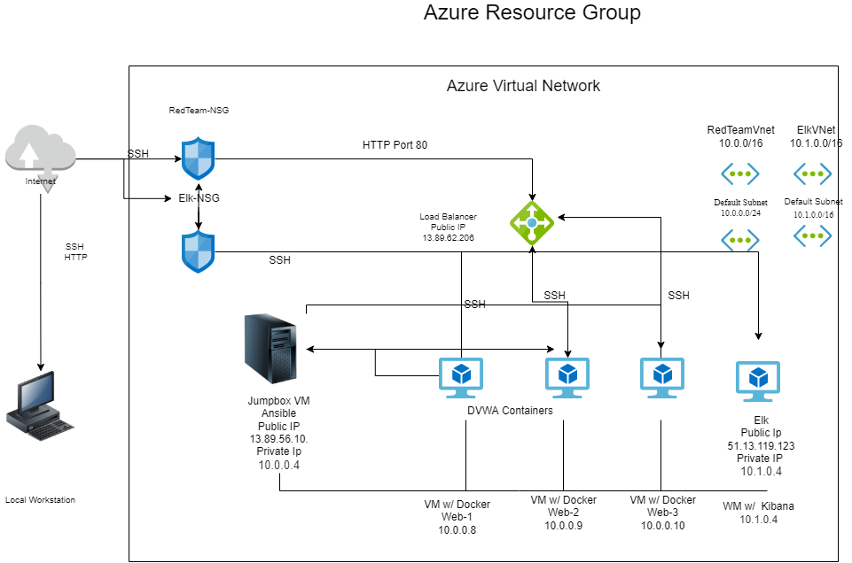

## Automated ELK Stack Deployment

The files in this repository were used to configure the network depicted below.

These files have been tested and used to generate a live ELK deployment on Azure. They can be used to either recreate the entire deployment pictured above. Alternatively, select portions of the file may be used to install only certain pieces of it, such as Filebeat.

  - [metricbeat-playbook.yml](Ansible/metricbeat-playbook.yml)
  - [filebeat-playbook.yml](Ansible/filebeat-playbook.yml)
  - [install-elk.yml](Ansible/install-elk.yml)
  - [pentest.yml](Ansible/pentest.yml)

This document contains the following details:
- Description of the Topologu
- Access Policies
- ELK Configuration
  - Beats in Use
  - Machines Being Monitored
- How to Use the Ansible Build

### Description of the Topology

The main purpose of this network is to expose a load-balanced and monitored instance of DVWA, the D*mn Vulnerable Web Application.

Load balancing ensures that the application will be highly available, in addition to restricting access to the network.
- _TODO: What aspect of security do load balancers protect? What is the advantage of a jump box?_

Integrating an ELK server allows users to easily monitor the vulnerable VMs for changes to the log files and system metrics.
- Filebeat monitors the log files or locations that you specify, collects log events, and forwards them either to Elasticsearch or Logstash for indexing.
- _Metricbeat takes the metrics and statistics that it collects and ships them to the output that you specify, such as Elasticsearch or Logstash.
The configuration details of each machine may be found below.

| Name                 | Function                   | IP Address | Operating System |
|----------------------|----------------------------|------------|------------------|
| Jump-Box-Provisioner | Gateway                    | 10.0.0.1   | Ubuntu LTS 18.04 |
| Elk                  |   Application Server       | 10.1.0.4   | Ubuntu LTS 18.04 |
| Web-1                |   Application Server       | 10.0.0.8   | Ubuntu LTS 18.04 |
| Web 2                |   Application Server       | 10.0.0.9   | Ubuntu LTS 18.04 |
| Web-3                |   Application Server       | 10.0.0.10  | Ubuntu LTS 18.04 |

### Access Policies

The machines on the internal network are not exposed to the public Internet. 

Only the Jump-Box-Provisioner and Elk machine can accept connections from the Internet. Access to this machine is only allowed from the following IP addresses:
- My Public IP Address

Machines within the network can only be accessed by Jump-Box-Provisioner.
 - Which machine did you allow to access your ELK VM? 
    Jump-Box-Provisioner
 - What was its IP address?
    13.89.56.10
A summary of the access policies in place can be found in the table below.

| Name     | Publicly Accessible | Allowed IP Addresses |
|----------|---------------------|----------------------|
| Jump-Box | Yes                 | My Public IP         |
| Elk      | Yes                 | 10.1.0.4             |
| Web-1    | No                  | 10.0.0.8             |
| Web-2    | No                  | 10.0.0.9             |
| Web-3    | No                  | 10.0.0.10            |

### Elk Configuration

Ansible was used to automate configuration of the ELK machine. No configuration was performed manually, which is advantageous because...
 - You can orchestrate the entire application environment no matter where it's deployed.

The playbook implements the following tasks:
 - Configure maximum mapped memory with sysctl module
 - Install docker.io and python3-pip packages with apt module
 - Install docker python package with pip
 - Enable systemd docker service
 - Run ELK docker container

The following screenshot displays the result of running `docker ps` after successfully configuring the ELK instance.

### Target Machines & Beats
This ELK server is configured to monitor the following machines:
 - Web-1: 10.0.0.8
 - Web-2: 10.0.0.9
 - Web-3: 10.0.0.10

We have installed the following Beats on these machines:
 - Filebeat
 - Metricbeat

These Beats allow us to collect the following information from each machine:
 - Filebeat parses and forwards system logs from the Web VMs to the ELK Stack in an easy to read format.
 - Metricbeat reports system and service statistics about the Web VMs to the ELK stack VM.

### Using the Playbook
In order to use the playbook, you will need to have an Ansible control node already configured. Assuming you have such a control node provisioned: 

SSH into the control node and follow the steps below:
- Copy the pentest.yml file to /etc/ansible.
- Update the host file to include IP address of your Virtual Machines
- Run the playbook, and navigate to http://[yourloadbalancerip]/setup.php to check that the installation worked as expected.

_TODO: Answer the following questions to fill in the blanks:_
- _Which file is the playbook? Where do you copy it?_
- _Which file do you update to make Ansible run the playbook on a specific machine? How do I specify which machine to install the ELK server on versus which to install Filebeat on?_
- _Which URL do you navigate to in order to check that the ELK server is running?

